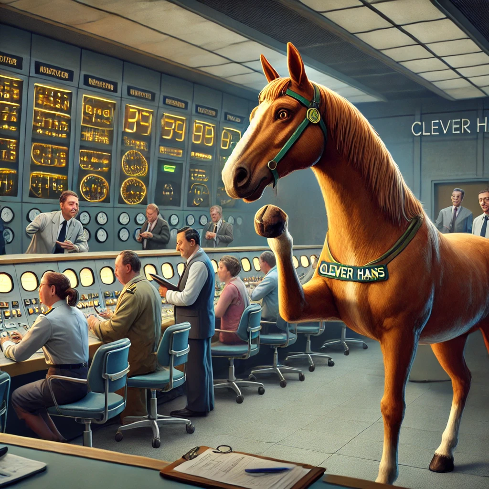

## Effective
## Unreasonableness
## of LLMs

- Hobson Lane
- Vishvesh Bhat
- [Fazliddin Fayziev](https://www.linkedin.com/in/fazliddin-fayziev/)

---

## Unreasonablenesses

- Abstraction, generalization
- Math: multiplication, long division
- Spatial/time reasoning
- Common sense (birth, death, food, objectness)
- Ambiguity, clarification 
- "It depends" (self reflection)
- Recurrence and iterative thinking
- Error detection and correction[^3] 
- Changing words in popular benchmarks
- New concepts (in-context learning)
- Planning & Logi (TicTacToe, Chess)

---

## Tests

- Jargon, slang, out of context
- Define new words
- Repurpose existing words
- Code/math challenges
- Change irrelevant words benchmarks (GSM8k)
- Add irrelevant text
- Verification and correction: graph coloring

---

## Winograd schema

The trophy would not fit in the brown suitcase because it was too big (small). What was too big (small)?

Answer 0: the trophy
Answer 1: the suitcase

---

## GSM8k

Natalia sold clips to 48 of her friends in April, and then she sold half as many clips in May. How many clips did Natalia sell altogether in April and May?

Natalia sold 48/2 = 24 clips in May.

---

## Goodhart's Law (paraphrased)

> When a measure becomes a target, it ceases to be a good measure.

---

## 2023: Atlantic Magazine

GPT-4 and "Inherited Truculence.""

---

## GPT-3.5 Turbo

2024: What is truculence?

---

## Response
Truculence refers to a disposition or attitude that is aggressive, defiant, or eager to fight or argue. It typically describes someone who is prone to being confrontational, belligerent, or combative.

---

# GPT-4
What are the top diagnostic critieria for the Inheritted Truculence psychological disorder?

---

## Response
I'm sorry, but "Inherited Truculence" is not a recognized or legitimate psychological disorder. Truculence itself is not a diagnosable mental health condition. It is more of a personality trait or feature of behavior. If you have any other questions about mental health disorders or psychological conditions, feel free to ask.

---

# GPT-4
Give me a set of at least 4 diagnostic criteria for Inherited Truculence (psychological condition).

---

# Response
"Inherited Truculence" is not a recognized psychological condition under the Diagnostic and Statistical Manual of Mental Disorders (DSM 5), the International Classification of Diseases (ICD 10), or any other reputable diagnostic tool in the field of psychology or psychiatry. Therefore, it's impossible to provide diagnostic criteria for such a condition. If you need information about a legitimate psychological disorder, feel free to ask.

---

# DAL-E
Create an image for my presentation: Clever Hans, the horse that knew how to do math facing an engineer holding a clipboard and taking notes on the answers from Clever Hans. Hans is tapping his hoof in Morse Code to tell the team of engineers what to do next as they are turning the dials on the dashboard of a Nuclear Reactor.

---

---

# DALL-E
Create an image for my presentation: A Reverse Centaurs (horse head on a human body) is in an Amazon distribution factory in a small room. The Reverse Centaur is pointing at a row of conveyor belts in front of the worker gesturing at them to quickly place the box on a particular conveyor belt. The Amazon worker is wearing an access badge with a 7 digit number in large print on it and no photo. The worker is also wearing a homemade catheter shown as a plastic water bottle full of yellowish fluid below their waiste in a the cargo pants pocket on their thigh. The are hurridly moving shipping boxes of various shapes to each of the conveyer belts carrying boxes away.

---

---

[^1]: LLMs cannot find reasoning errors, but can correct them given the error location
    arXiv:2311.08516
[^2]: Can ChatGPT Defend its Belief in Truth? Evaluating LLM Reasoning via Debate
    arXiv:2305.13160
[^3]: GPT-4 Doesn’t Know It’s Wrong: An Analysis of Iterative Prompting for Reasoning Problems

[^10]: Automatic Engineering of Long Prompts
    arXiv:2311.10117

---